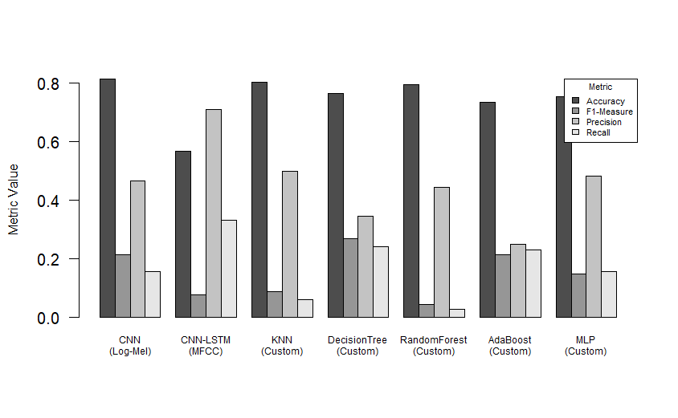

# Log-Mel Spectrogram Features for Depression Detection

This project explores the use of Log-Mel Spectrogram Features for Depression Detection,
conducting a comparative study with the results reported in the [EATD-Corpus](https://arxiv.org/pdf/2202.08210.pdf) paper.
We replicated their findings using the provided `baseline_replication.ipynb` notebook,
which consolidates code from the original [GitHub](https://github.com/speechandlanguageprocessing/ICASSP2022-Depression) repository,
while our experiments can be found at the `depression_detection.ipynb` notebook.

> [!IMPORTANT]
> Preview the main project files below:
> 
> | File | Instructions | Link |
> |------|--------------|------|
> | `baseline_replication.ipynb` | Replicated Results from the EATD-Corpus Paper |  |
> | `depression_detection.ipynb` | Experiments Performed on the EATD-Corpus |  |
> | `Depression-Detection.pdf` | Research Paper Reporting the Experiments |  |

## Installation and Usage

The project was developed using `Python` and within Google Colaboratory environment.
The notebooks cover instructions for any additional packages to be installed.
Deep learning models were developed using `PyTorch`, while for the traditional classifiers we employed `Scikit-Learn`.

## Dataset

This project focuses on utilizing audio recordings from the EATD-Corpus to detect depression status.
The EATD-Corpus dataset consists of 162 student volunteers' interviews (2.26 hours total) with a sample rate of 16KHz.
The training set includes 83 volunteers (19 depressed, 64 non-depressed) and the validation set includes 79 volunteers (11 depressed, 68 non-depressed).
In the original study, however, all these data are merged together and a 3-fold cross-validation is performed.

> [!NOTE]  
> The dataset can be directly downloaded from the following link (**Password:** `Ymj26Uv5`):
> 
> 

> [!IMPORTANT]  
> According to our code, the dataset should be placed in Google Drive for ease of access under the following path: `/content/drive/MyDrive/Data/DepressionDetection/EATD-Corpus`

## Methods

in our approach, we separate preprocessing from feature extraction by concatenating waveforms before applying zero-padding
to ensure uniform lengths for subsequent feature extraction techniques. Then, three different experiments are performed as following:
1. Convolutional Neural Network (CNN) utilizing the Log-Mel spectrogram features 
2. CNN-LSTM netowork employing the MFCC features 
3. Traditional classifiers (`KNN`, `DecisionTree`, `RandomForest`, `AdaBoost`, and `MLP`) performed on custom statistical features.

## Results

Our investigation into the EATD-Corpus demonstrates the possible potential of using acoustic features for depression detection.
However, the moderate performance highlights the necessity for advanced preprocessing techniques and tailored algorithmic frameworks to address the complexity of the underlying data.
Future research should prioritize developing robust methods for data preprocessing, feature selection,
and addressing data imbalance to fully exploit the potential of EATD-Corpus in identifying individuals with depression.
The results achieved on the replicated and experimented settings are illustrated below:

